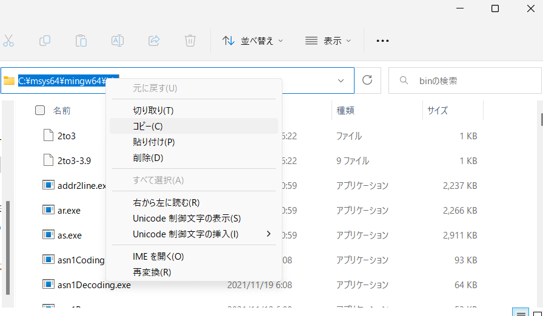
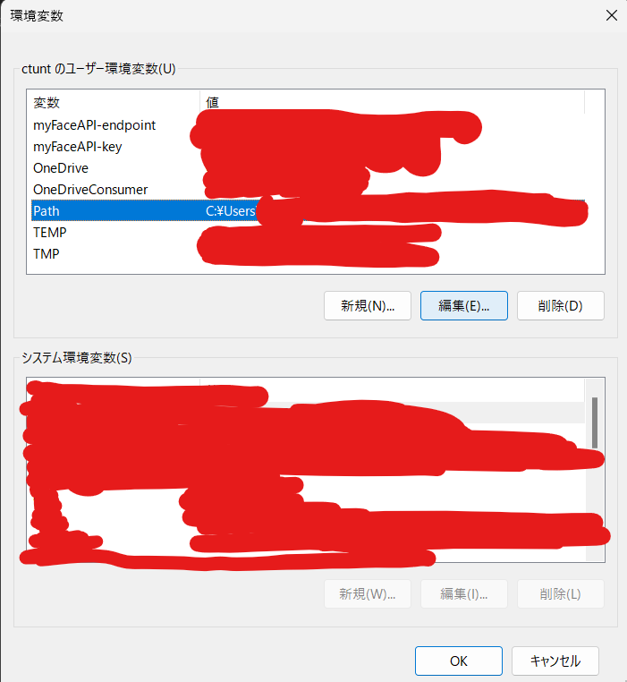
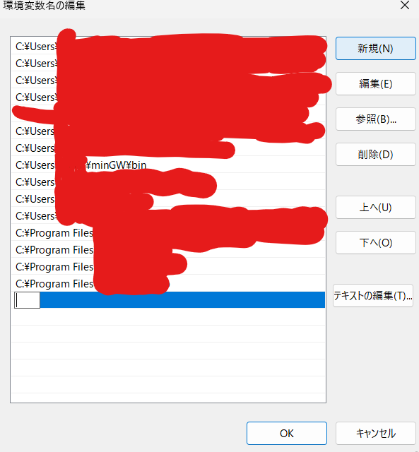

# 家でもC++をやりたい！

①以下からインストーラー(.exeファイル)をダウンロードする。
>https://www.msys2.org/

②インストーラーを起動。
この際、いろいろ聞かれるが全てYESでOK。

③全てのアプリから「MSYS2 MinGW x64」を起動。起動すると、コマンドラインが表示されるはず。

④以下のコマンドを実行。これまた、色々聞かれるが全てYESでOK。

`pacman -Syu`

`pacman -Su`

`pacman -S mingw-w64-x86_64-gcc mingw-w64-x86_64-gdb`

⑤以下のコマンドでエラーじゃないのが表示されれば成功！

`gcc -v`

⑥エクスプローラーからCドライブ（に相当するもの）→　「msys64」　→　「mingw64」→　「bin」に移動。以下の図のようにコピーをする(⑨まで他のものをコピーしないでください)。

  

⑦windows上（虫眼鏡のヤツ）で「環境変数を編集」で検索。

⑧「path」を選択した状態で、編集をクリック

  

⑨新規をクリックし、作成された空白に⑥でコピーしたものを貼り付け、OKを選択。

  

⑩ターミナルなり実行環境を再起動したら、いつも通り「g++ <ファイル名>」ができるようになってる……はず!!!

※インストール時に全てYESにしろと言いましたが、「環境を荒らされたくない」などと思う有識者の方はいろいろ変更してくれても構いません（ただし、自己責任でよろしく）。

# 参考文献
>https://qiita.com/kthksgy/items/68fa6784af95a1d9b52b
